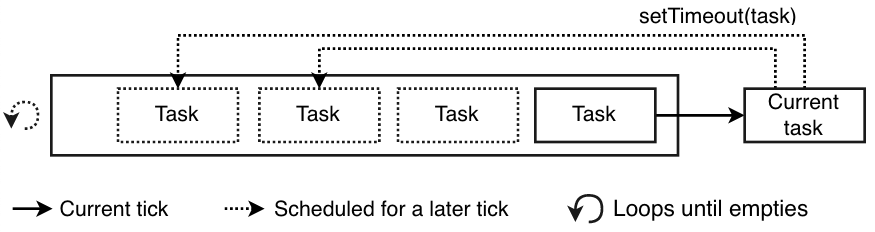

Potential titles:

- How JS Works: The Event Loop
- How JS Works: `setTimeout`
- How Async JS Works
- Async JS In Depth
- JS `setTimeout` In Depth
- JavaScript's Execution Model

# &lt; Insert Title Here &gt;

_This is the first in a series of two posts about JavaScript's execution model. This post focuses on the Call Stack and Event Loop. The second post builds on this by discussing how Promises fit into the picture._

I've been writing JavaScript for awhile. I've written web services with Express, web apps with React, mobile apps with React Native, and I've authored libraries, such as [`pdf-lib`](https://github.com/Hopding/pdf-lib).

Recently, while working on `pdf-lib`, I found myself dealing with some long running synchronous code. I had optimized this code to run as fast as possible. Yet, when this code ran it would sometimes freeze the web page and cause the browser to warn about a script slowing down the browser.

I realized this function needed to be broken apart somehow. It needed to be asynchronous in order to allow other work to be done before it finished. But the function itself wasn't doing any fundamentally asynchronous work (it didn't make any HTTP requests or perform any file I/O).

How does one take a fundamentally synchronous task and make it asynchronous? I didn't know how to do this. To figure it out, I spent some time learning the intricacies of `setTimeout()`, `Promise.resolve()`, the Event Loop, and JavaScript's [execution model](https://en.wikipedia.org/wiki/Execution_model) in general.

My goal in writing this series of posts is to share what I learned. After reading through them, I hope that you will have a much better understanding of JavaScript's execution model, and how async JavaScript actually works under the hood.

# A Working Example

Let's start by writing some code to reproduce the problem I encountered while working on `pdf-lib`. Most of us are familiar with the [prime number sequence](https://en.wikipedia.org/wiki/Prime_number), so let's write a function to compute it:

```js
function isPrime(n) {
  for (let i = 2; i < n; i++) {
    if (n % i === 0) return false;
  }
  return true;
}

function computePrimes(onPrime, startAt = 1) {
  let currNum;
  for (currNum = startAt; true; currNum++) {
    if (isPrime(currNum)) onPrime(currNum);
  }
}
```

- The `isPrime()` function is very simple. It returns `true` if a number is prime, and `false` if it isn't.

- The `computePrimes()` function runs indefinitely. It checks every number from 1 to infinity to see if it's prime. Whenever one is found, it's passed to the `onPrime` callback.

Let's try it out:

```js
computePrimes(prime => {
  console.log(prime);
});
// => 1 2 3 5 7 11 13 ...
```

(If you run this in a Node REPL, you'll have to ctrl-c to stop it. In a browser, you can just close the tab)

Logging the primes is fun and all, but I'd rather see how many primes we've calculated instead of the values themselves. Let's make a simple website to render a live count for us!

<!-- prettier-ignore -->
```html
<!DOCTYPE html>
<html>
  <head><meta charset="utf-8" /></head>

  <body>
    <button onclick="startComputingPrimes()">Start Computing Primes</button>
    <div id="primes-count"></div>
  </body>

  <script type="text/javascript">
    /* Insert isPrime() and computePrimes() here... */

    let primesCount = 0;
    const primesCountDiv = document.getElementById('primes-count');

    function startComputingPrimes() {
      computePrimes((prime) => {
        primesCount += 1;
        if (primesCount % 500 === 0) {
          const msg = `Total Primes Found: ${primesCount}`;
          primesCountDiv.textContent = msg;
          console.log(msg);
        }
      });
    }
  </script>
</html>
```

When you load this webpage in a browser, you'll see the following:


Let's click the `Start Computing Primes` button and see what happens:


Oh, that's too bad. We don't get a live `Total Primes Found` count. Instead the browser warns us that the webpage is running slow, and gives us the opportunity to stop it.

Our code is definitely running, you can see that by the logs it's printing. That means our `primesCountDiv.textContent = msg;` line is also executing. So why isn't our `primes-count` div updating? And not only is our div stuck, but the button is still rendered in the `pressed` state! It seems like the webpage isn't re-rendering for some reason...

Let's see if we can fix this with some magic 🎩🐇✨. Rewrite the `computePrimes()` function like so:

```js
function computePrimes(onPrime, startAt = 1) {
  let currNum;
  for (currNum = startAt; currNum % 500 !== 0; currNum++) {
    if (isPrime(currNum)) onPrime(currNum);
  }
  setTimeout(() => computePrimes(onPrime, currNum + 1), 0); // Magic‽
}
```

Now what happens when we click the `Start Computing Primes` button?


It works! But why...? To answer this question, we need to talk about JavaScript's **Call Stack** and **Event Loop**. Let's start with the Call Stack.

# The Call Stack

The Call Stack is a fundamental part of the JavaScript language. It is a record-keeping structure that allows us to perform function calls. Each function call is represented as a **frame** on the call stack. This is how the JavaScript engine keeps track of which functions have been called and in what order. The JS engine uses this information to ensure execution picks back up in the right spot after a function returns.

When a JavaScript program first starts executing, the Call Stack is empty. When the first function call is made, a new frame is pushed onto the top of the Call Stack. When that function returns, its frame is popped off of the Call Stack. Let's look at an example.

Consider the following code snippet:

```js
function main() {
  doStuff('baz');
}

function doStuff(x) {
  doThings(x);
  foo();
}

function doThings(y) {
  console.log('Things done', y);
}

function foo() {
  return 'bar';
}

main();
```

Let's look at each transition made in the Call Stack while executing the above snippet:

```
| State 1 |   | State 2 |   |      State 3     |   |      State 4     |
|---------|   | main()  |   | doStuff(x='baz') |   | doThings(y=x)    |
              |---------|   | main()           |   | doStuff(x='baz') |
                            |------------------|   | main()           |
                                                   |------------------|

|      State 5     |   |      State 6     |   | State 7 |   | State 8 |
| foo()            |   | doStuff(x='baz') |   | main()  |   |---------|
| doStuff(x='baz') |   | main()           |   |---------|
| main()           |   |------------------|
|------------------|
```

This visualization of the Call Stack is familiar to most of us. We all have an intuitive feel for what's going on here. However, the Call Stack is only part of JavaScript's execution model. It doesn't tell the full story. Consider this snippet:

```js
const logA = () => console.log('A');
const logB = () => console.log('B');
const logC = () => console.log('C');

logA();
setTimeout(logB, 100);
logC();

// => A C B
```

How is it that `B` is logged last? The Call Stack always works in order. But what we see here is happening out of order.

`setTimeout` is responsible for the out-of-order logging we're seeing. What we've done is told JavaScript to call `logB` in 100 milliseconds. And because computers are fast, logC() will have been called long before 100 milliseconds have expired.

But what if we pass a timeout of 0 milliseconds?

```js
logA();
setTimeout(logB, 0);
logC();
// => A C B
```

Interesting! The same thing still happens. To understand why, we need to understand what `setTimeout` is actually doing under the hood. Clearly, it's not your typical function. Its behavior cannot be explained with the Call Stack alone. To explain how `setTimeout` works, we need to talk about the **Event Loop**.

# The Event Loop

If the Call Stack keeps track of the functions that are executing right now, then the Event Loop keeps track of functions that are going to be executed in the future. The term **Event Loop** refers to two things:

- The **Task Queue**, which is a FIFO queue of tasks.
- The looping algorithm that processes the tasks in the Task Queue.

**Tasks** are synchronous blocks of code. You can think of them as `Function` objects.

The Event Loop works by continuously looping through the Task Queue and processing the tasks it contains one by one. A single iteration of the Event Loop is called a **tick**.

```js
while (EventLoop.waitForTask()) {
  EventLoop.processNextTask();
}
```

To process a task, the Event Loop invokes the `Function` associated with it. While a task is running, it has exclusive access to the Call Stack. The Event Loop waits to process the next task until the current task is finished, and the Call Stack is empty.

While a task is running, it can enqueue other tasks to be processed in subsequent ticks of the Event Loop. There are several ways to do this, the simplest of which is `setTimeout(taskFn, 0)`. Tasks can also come from external sources such as DOM and network events.



(Diagram Credit: [Bertalan Miklos](https://blog.risingstack.com/writing-a-javascript-framework-execution-timing-beyond-settimeout/))

Let's visualize our last code snippet with a Call Stack and Task Queue:

```
============ State 1 ============
|  Call Stack  |   | Task Queue |
|--------------|   |------------|

============ State 2 ============
|  Call Stack  |   | Task Queue |
| logA()       |   |------------|
|--------------|

============ State 3 ============
|  Call Stack  |   | Task Queue |
| setTimeout() |   | logB       |
|--------------|   |------------|

============ State 4 ============
|  Call Stack  |   | Task Queue |
| logC()       |   | logB       |
|--------------|   |------------|

============ State 5 ============
|  Call Stack  |   | Task Queue |
|--------------|   | logB       |
                   |------------|

============ State 6 ============
|  Call Stack  |   | Task Queue |
| logB()       |   |------------|
|--------------|
```

# One Event at a Time

JavaScript has a single Call Stack. Because of this, the Event Loop is only allowed to process one task at a time. This makes for a relatively simple execution model that saves JavaScript from a host of concurrency issues.

Consider [reentrancy](<https://en.wikipedia.org/wiki/Reentrancy_(computing)>), defined by Wikipedia as follows:

> ... a computer program or subroutine is called reentrant if it can be interrupted in the middle of its execution and then safely be called again ("re-entered") before its previous invocation's complete execution. The interruption could be caused by an internal action such as a jump or call, or by an external action such as an interrupt or signal. Once the reentered invocation completes, the previous invocations will resume correct execution.

JavaScript programmers don't have to worry about making their functions reentrant, because they can never be interrupted[^1]! JS functions always run to completion.

[^1]: This isn't strictly true. For example, generators and recursive functions can be entered a second time before their initial invocation is complete. However, this is not a concurrency issue forced upon the developer by the runtime. So this scenario isn't representative of the context in which reentrancy is typically a concern for developers.

However, this simple execution model doesn't come without risks.

Suppose a "rogue" task makes its way onto the Call Stack. This rogue task never finishes running, and occupies the Call Stack indefinitely. If this happens, the rogue task will prevent all other tasks from ever being processed. This means all other work will grind to a halt, hindering critical tasks such a rerendering!

For this reason, web browsers monitor how much time tasks spend on the Call Stack. If a task takes too long to finish, the browser alerts the user and gives them the option to "Stop It" - removing the task from the Call Stack and allowing other events to be processed.

# How our Magic Works

Let's return to our example. Before we added magic to it, our code was causing the webpage to freeze. And after a bit of time, the browser gave us the option to stop it. This happened because our `computePrimes()` function went rogue. After it was placed on the Call Stack it never finished running. It blocked the Call Stack and prevented rendering tasks from being processed.

We were able to fix this by adding some magic. Of course, it wasn't _really_ magic. And now that we've talked about the Call Stack and Event Loop, we can understand how it actually works.

We started with a single infinitely long task. And our magic broke it up into a series of short running tasks. Each task would compute 500 primes and then enqueue a new task to compute the next 500 primes (using `setTimeout(computePrimes, 0)`). This allowed the JS engine to handle other tasks that had been enqueued in-between prime calculations.

Without Magic:

```
|    Call Stack   |   | Task Queue |
| computePrimes() |   | rerender   |
|-----------------|   | rerender   |
                      | rerender   |
                      | ...        |
                      |------------|
```

With Magic:

```
|    Call Stack   |   |   Task Queue  |
| computePrimes() |   | rerender      |
|-----------------|   | computePrimes |
                      | rerender      |
                      | computePrimes |
                      | rerender      |
                      | ...           |
                      |---------------|
```

# Conclusion

JavaScript is a single-threaded, non-blocking, asynchronous programming language. As JavaScript developers, we deal with these language features on a daily basis. We tend to have an intuitive understanding of how to write and use async JavaScript.

However, for many of us this intuitive understanding is not backed by a strong grasp of JavaScript's execution model and how it all works under the hood. This is unfortunate, because it can result in wasted effort over things that shouldn't really be a concern (e.g. making functions reentrant). And it can prevent us from understanding how to troubleshoot certain performance issues (e.g. long-running synchronous functions).

I hope this post has helped you better understand JavaScript's execution model! Please consider reading the second post in this series to learn how `Promises` fit into the picture.

# Primary Sources

- [JavaScript Language Specification](https://www.ecma-international.org/ecma-262/9.0/index.html)
- [HTML Scripting Specification](https://www.w3.org/TR/html52/webappapis.html)

# Secondary Sources

- [https://developer.mozilla.org/en-US/docs/Web/JavaScript/EventLoop](https://developer.mozilla.org/en-US/docs/Web/JavaScript/EventLoop)
- [https://nodejs.org/en/docs/guides/event-loop-timers-and-nexttick/](https://nodejs.org/en/docs/guides/event-loop-timers-and-nexttick/)
- [https://www.quora.com/Does-JavaScript-in-the-browser-have-the-equivalent-of-process-nextTick-or-setImmediate-in-node-js-or-do-we-just-have-setTimeout](https://www.quora.com/Does-JavaScript-in-the-browser-have-the-equivalent-of-process-nextTick-or-setImmediate-in-node-js-or-do-we-just-have-setTimeout)
- [https://stackoverflow.com/questions/26615966/how-to-make-non-blocking-javascript-code](https://stackoverflow.com/questions/26615966/how-to-make-non-blocking-javascript-code)
- [http://latentflip.com/loupe/](http://latentflip.com/loupe/)
- [https://www.youtube.com/watch?v=8aGhZQkoFbQ](https://www.youtube.com/watch?v=8aGhZQkoFbQ)
- [https://stackoverflow.com/questions/38752620/promise-vs-settimeout](https://stackoverflow.com/questions/38752620/promise-vs-settimeout)
- [https://blog.bitsrc.io/microtask-and-macrotask-a-hands-on-approach-5d77050e2168](https://blog.bitsrc.io/microtask-and-macrotask-a-hands-on-approach-5d77050e2168)
- [https://blog.risingstack.com/writing-a-javascript-framework-execution-timing-beyond-settimeout/](https://blog.risingstack.com/writing-a-javascript-framework-execution-timing-beyond-settimeout/)
- [https://stackoverflow.com/questions/24117267/nodejs-settimeoutfn-0-vs-setimmediatefn](https://stackoverflow.com/questions/24117267/nodejs-settimeoutfn-0-vs-setimmediatefn)
- [https://stackoverflow.com/questions/779379/why-is-settimeoutfn-0-sometimes-useful](https://stackoverflow.com/questions/779379/why-is-settimeoutfn-0-sometimes-useful)
- [https://developer.mozilla.org/en-US/docs/Tools/Performance/Scenarios/Intensive_JavaScript](https://developer.mozilla.org/en-US/docs/Tools/Performance/Scenarios/Intensive_JavaScript)
- [https://jakearchibald.com/2015/tasks-microtasks-queues-and-schedules/](https://jakearchibald.com/2015/tasks-microtasks-queues-and-schedules/)
- [https://esdiscuss.org/topic/the-initialization-steps-for-web-browsers#content-16](https://esdiscuss.org/topic/the-initialization-steps-for-web-browsers#content-16)
- [https://blog.sessionstack.com/how-javascript-works-the-building-blocks-of-web-workers-5-cases-when-you-should-use-them-a547c0757f6a](https://blog.sessionstack.com/how-javascript-works-the-building-blocks-of-web-workers-5-cases-when-you-should-use-them-a547c0757f6a)
- [https://blog.sessionstack.com/how-javascript-works-event-loop-and-the-rise-of-async-programming-5-ways-to-better-coding-with-2f077c4438b5](https://blog.sessionstack.com/how-javascript-works-event-loop-and-the-rise-of-async-programming-5-ways-to-better-coding-with-2f077c4438b5)
- [https://stackoverflow.com/questions/2734025/is-javascript-guaranteed-to-be-single-threaded/2734311#2734311](https://stackoverflow.com/questions/2734025/is-javascript-guaranteed-to-be-single-threaded/2734311#2734311)
- [https://en.m.wikipedia.org/wiki/Reentrancy\_(computing)](<https://en.m.wikipedia.org/wiki/Reentrancy_(computing)>)
- [https://stackoverflow.com/a/19699970](https://stackoverflow.com/a/19699970)
