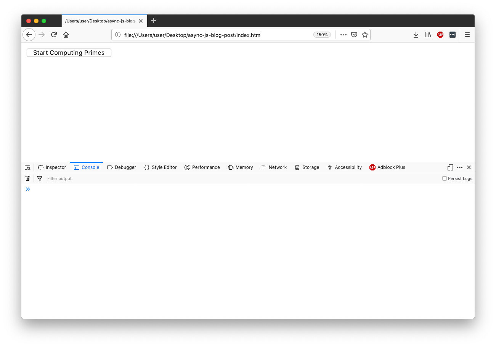
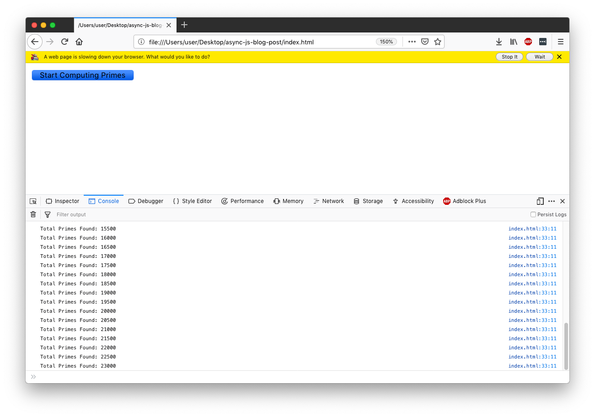
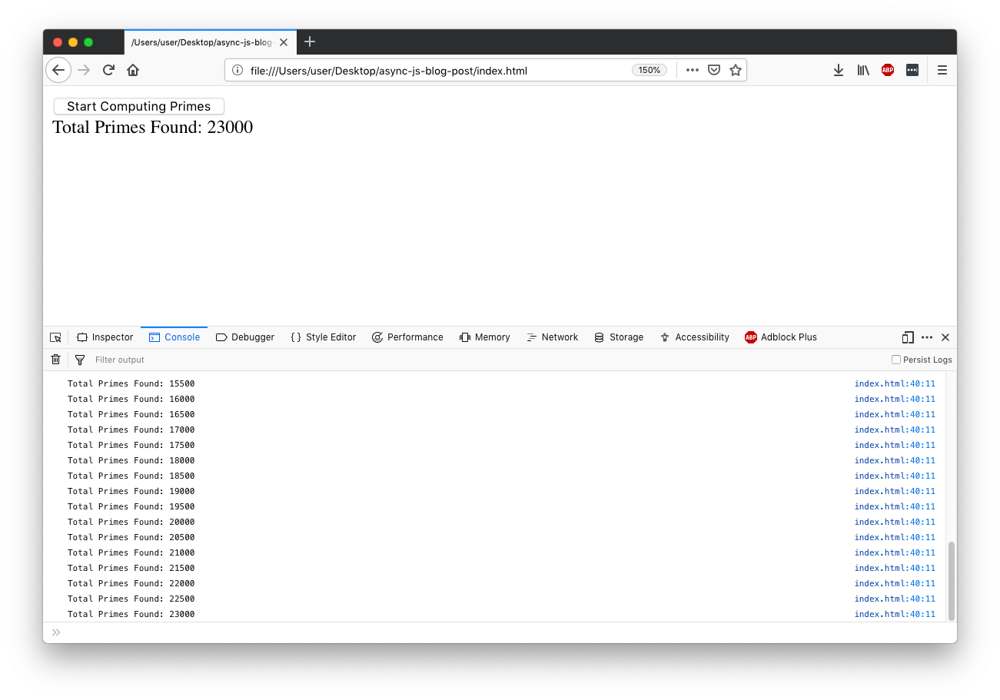

What is JavaScript? How does it work?

Most JavaScript developers know what a call stack is. You've probably used Promises to write async code. You've likely heard that JavaScript is single-threaded. Maybe you've even heard about this thing called the "Event Loop".

But do you understand how JavaScript works under the hood? Are you comfortable thinking about JavaScript's [execution model](https://en.wikipedia.org/wiki/Execution_model)? A few weeks ago I would have answered no to both of these questions. But after a lot of research and experimentation, I now have a much better understanding. And I hope that after reaching the end of the post you will as well!

But before we get too abstract, let's write a bit of code. Most of us are familiar with the [prime number sequence](https://en.wikipedia.org/wiki/Prime_number), so let's write a function to compute it:

```js
function isPrime(n) {
  for (let i = 2; i < n; i++) {
    if (n % i === 0) return false;
  }
  return true;
}

function computePrimes(onPrime) {
  for (let currNum = 1; true; currNum++) {
    if (isPrime(currNum)) onPrime(currNum);
  }
}
```

- The `isPrime()` function is very simple. It returns `true` if a number is prime, and `false` if it isn't.

- The `computePrimes()` function runs indefinitely. It checks every number from 1 to infinity to see if it's prime. Whenever one is found, it's passed to the `onPrime` callback.

Let's try it out:

```js
computePrimes(prime => {
  console.log(prime);
});
// => 1 2 3 5 7 11 13 ...
```

(If you run this in a Node REPL, you'll have to ctrl-c to stop it. In a browser, you can just close the tab)

Logging the primes is fun and all, but I'd rather see how many primes we've calculated than the values themselves. Let's make a simple website to render a live count for us!

<!-- prettier-ignore -->
```html
<!DOCTYPE html>
<html>
  <head><meta charset="utf-8" /></head>

  <body>
    <button onclick="startComputingPrimes()">Start Computing Primes</button>
    <div id="primes-count"></div>
  </body>

  <script type="text/javascript">
    /* Insert isPrime() and computePrimes() here... */

    let primesCount = 0;
    const primesCountDiv = document.getElementById('primes-count');

    function startComputingPrimes() {
      computePrimes((prime) => {
        primesCount += 1;
        if (primesCount % 500 === 0) {
          const msg = `Total Primes Found: ${primesCount}`;
          primesCountDiv.textContent = msg;
          console.log(msg);
        }
      });
    }
  </script>
</html>
```

When you load this webpage in a browser, you'll see the following:



Let's click the `Start Computing Primes` button and see what happens:



Oh, that's too bad. We don't get a live `Total Primes Found` count. Instead the browser warns us that the webpage is running slow, and gives us the opportunity to stop it 🙁.

Our code is definitely running, you can see that by the logs it's printing. That means our `primesCountDiv.textContent = msg;` line is also executing. So why isn't our `primes-count` div updating? And not only is our div stuck, but the button is still rendered in the `pressed` state! It seems like the webpage isn't re-rendering properly for some reason 🤔.

Let's see if we can fix this with some magic 🎩🐇✨. Rewrite the `computePrimes()` function like so:

```js
async function computePrimes(onPrime) {
  for (let currNum = 1; true; currNum++) {
    if (isPrime(currNum)) onPrime(currNum);
    if (currNum % 500 === 0) await new Promise(setTimeout); // Magic‽
  }
}
```

Now what happens when we click the `Start Computing Primes` button?



It works! But why...? To answer this question, we need to talk about JavaScript's **Event Loop**.

## The Event Loop

So what is an event loop and how does it relate to JavaScript? The best way to start explaining this is to talk about the **Call Stack**.

The call stack is a fundamental structure that allows us to perform function calls. Each function call is represented as a **frame** on the call stack. This is how the JavaScript engine keeps track of which functions called one another. This is important in order for execution to pick back up in the right spot once a function returns.

When a JavaScript program first starts executing, the call stack is empty. When the first function call is made, a new frame is pushed onto the top of the call stack. When that function returns, its frame is popped off of the call stack. Let's look at an example.

Consider the following code snippet:

```js
function main() {
  doStuff('baz');
}

function doStuff(x) {
  doThings(x);
  foo();
}

function doThings(y) {
  console.log('Things done', y);
}

function foo() {
  return 'bar';
}

main();
```

Let's look at each transition made in the call stack while executing the above snippet:

```
| State 1 |   | State 2 |   |      State 3     |   |      State 4     |
|---------|   | main()  |   | doStuff(x='baz') |   | doThings(y=x)    |
              |---------|   | main()           |   | doStuff(x='baz') |
                            |------------------|   | main()           |
                                                   |------------------|

|      State 5     |   |      State 6     |   | State 7 |   | State 8 |
| foo()            |   | doStuff(x='baz') |   | main()  |   |---------|
| doStuff(x='baz') |   | main()           |   |---------|
| main()           |   |------------------|
|------------------|
```

This visualization of the call stack is very familiar to most of us. We all have an intuitive feel for what's going on here. However, the call stack is only party of JavaScript's execution model. It doesn't tell the full story. Consider this snippet:

```js
const logA = () => console.log('A');
const logB = () => console.log('B');
const logC = () => console.log('C');

logA();
setTimeout(logB, 100);
logC();

// => A C B
```

How is it that `B` is logged last? The call stack can't explain what's going on in this example. The call stack always works in order. But what we see here is happening out of order.

You've probably worked with `setTimeout` before. And you know that it is responsible for the out-of-order logging we're seeing. What we've done is "told JavaScript" to call `logB` in 100 milliseconds. And because computers are fast, logC() will have been called long before 100 milliseconds have expired.

But what if we pass a timeout of 0 milliseconds?

```js
logA();
setTimeout(logB, 0);
logC();
// => A C B
```

Interesting! The same thing always happens. To understand why, we need to understand what `setTimeout` is actually doing under the hood. Clearly, it's not your typical function. Its behaviour cannot be explained in terms of the call stack.
